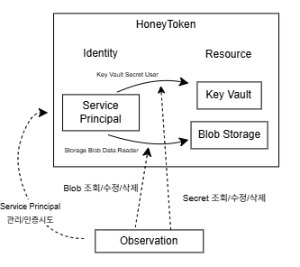

# Azure 허니토큰 & 로그 수집 환경 구성

Azure 환경에서 허니토큰과 미끼 리소스를 Terraform으로 구성하고, 허니 Identity 및 Decoy Resource에서 발생하는 행위를 Azure 로그로 수집할 수 있는 환경을 구성했습니다.

현재는 Honey Identity, Decoy Resource, RBAC을 생성하고 Key Vault와 Blob Storage를 통해 미끼 리소스를 배치한 상태이며, 이후 접근 행위를 수집하고 분석할 수 있도록 Taint 부여에 관한 내용을 구성하는 것을 목표로 합니다.

<br>

## 인프라 구성

HoneyToken 환경은 Identity, Resource로 구성되며 다음과 같은 구성을 가집니다. 




<br>

## 폴더 구조

```text
terraform/
├─ providers.tf
├─ variables.tf
├─ terraform.tfvars
├─ resource_group.tf
├─ identity.tf
├─ key_vault.tf
├─ storage.tf
└─ monitoring.tf 
```

허니토큰 위치입니다.  

```text
identity.tf
├─ Honey Application
├─ Honey Service Principal
└─ RBAC Role Assignment

key_vault.tf
├─ Azure Key Vault 생성
└─ Honey Secret 생성
   └─ prod-api-key

storage.tf
├─ Storage Account 생성
├─ Blob Container 생성
└─ Decoy Blob 생성
   └─ credentials.txt

monitoring.tf
├─ Log Analytics Workspace
└─ Diagnostic Settings
   ├─ Key Vault
   └─ Blob Storage
```

<br>

## 허니토큰 설계

### Identity

허니 Identity는 정상 서비스에서 사용되지 않도록 설계해야 합니다.

```text
Honey Identity
└─ Service Principal
   └─ sp-taintlab-honey-...
```

현재 Key Vault에는 Honey Service Principal이 존재합니다.  
해당 Identity에는 Key Vault Secrets User 권한이 부여되어 있습니다.  

`Key Vault Secrets User`는 Key Vault 내부 Secret 값을 조회할 수 있는 권한입니다.  

### Resource

현재 리소스를 구성입니다.  

```text
Decoy Resource
├─ Key Vault
│  └─ Secret: prod-api-key
│     └─ DECOY-API-KEY
│
└─ Storage Account
   └─ Blob Container
      └─ credentials.txt
```

`prod-api-key`는 Key Vault Secret 형태의 Honey Secret입니다.   
secret 정의 형식은 `terraform.tfvars.example`에서 확인 가능합니다.  

Blob Storage에는 임시로 중요해보이는 파일을 배치했습니다.  

```text
credentials.txt

Username: backup-admin
Password: DECOY_PASSWORD_NOT_REAL
```

따라서 현재 환경에서는 Honey Service Principal 사용하거나,  
Honey Key Vault Secret 또는 Honey Blob 접근이 가능한 상태입니다.  

해당 리소스에 접근한 Identity를 이후 C-Taint 전파 대상으로 사용할 수 있습니다.  

<br>

## 로그 수집 구성

Azure은 모니터링하려는 리소스별 로그를 지정해 수집합니다.   
`monitoring.tf`에서 설정을 볼 수 있습니다.  

### Key Vault

- prod-api-key 조회
- Secret 목록 조회
- Secret 수정
- Secret 삭제


이후 Log Analytics에서는 `AZKVAuditLogs`를 기준으로 Honey Secret 접근 여부를 확인할 수 있습니다.  

### Blob Storage

- StorageRead
- StorageWrite
- StorageDelete

현재 Honey Blob인 `credentials.txt` 접근 여부를 확인하는 것이 목적입니다.  

Log Analytics에서는 `StorageBlobLogs`를 이용해 접근 이벤트를 확인할 수 있습니다.

### Identity 로그

- ServicePrincipalSignInLogs
- AuditLogs

Honey Service Principal의 인증시도와 생성/수정 등의 관리 행위를 수집합니다.

Log Analytics에서는 AADServicePrincipalSignInLogs를 이용해 Honey Identity의 인증 여부를 확인할 수 있습니다.


<br>

## 로그 생성 방법

<br>

## 로그 수집 결과

